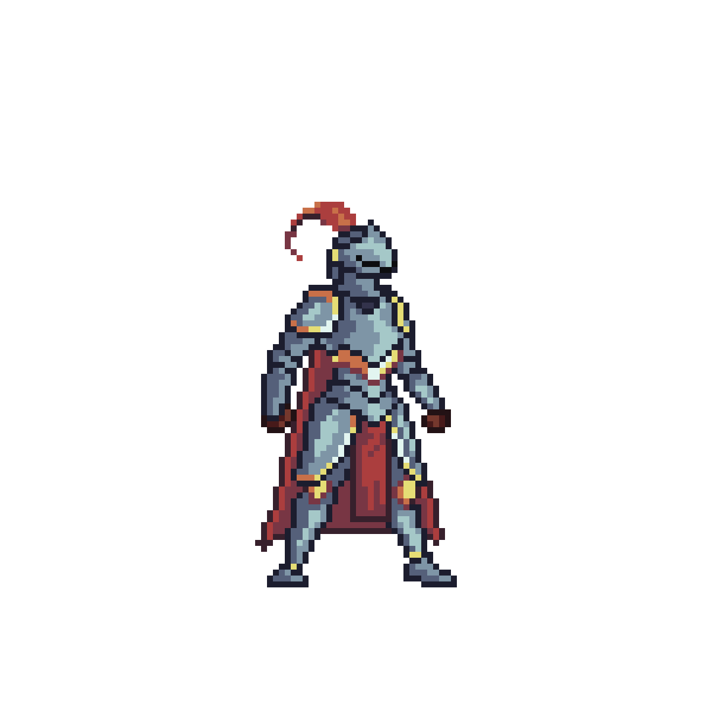

<!-- ===================== -->
<!-- GitHub Profile README -->
<!-- ===================== -->

<div align="center">


<div align="left" width="100%"> 
    # ✨ My Lige I am Your Humble Knight<br>Sir Prasanna ✨ 
</div>

**Software Engineering Undergraduate · Game Dev · DevOps · Systems Nerd**

> Building things to understand how reality ticks,  
> then breaking them to learn faster.

</div>

---

## 🧠 About Me

- 🔧 I enjoy **low-level systems**, networking, and infrastructure
- 🎮 I build **games and simulations** to explore complex ideas
- 🐧 Daily-driving Linux and self-hosting everything I can
- 🌏 Curious about languages, psychology, and how humans think
- ⚙️ Strong believer in learning by *building first, theorizing second*

---

## 🛠️ Tech Stack

### Languages
<p>
 
 
 
 
 
</p>

```rust
fn mindset() -> &'static str {
    "Build → Break → Learn → Repeat"
}
